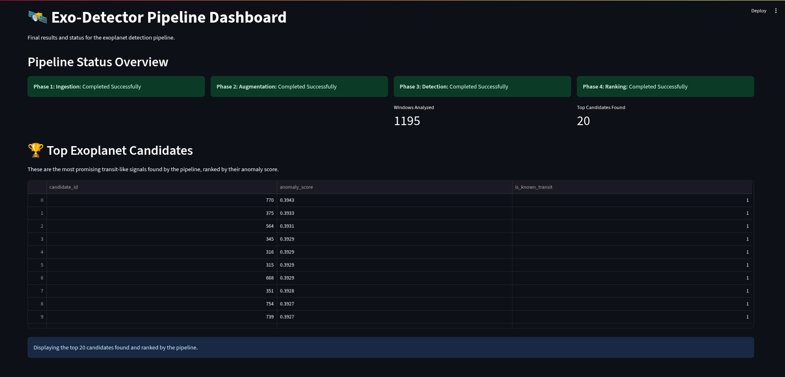

# Exo-Detector

This Exo-Detector project offers an automated AI pipeline designed to identify potential exoplanets from the vast amounts of data generated by NASA's TESS mission. This streamlined process addresses the impracticality of manual analysis, enabling efficient discovery of new worlds.

---

## Key Features

* **Real Data Integration:** Connects directly to NASA's official archives to download and process real light curve data from confirmed TESS Objects of Interest (TOIs).
* **Advanced AI Augmentation:** Employs a Conditional VAE-GAN, a state-of-the-art generative model, to learn from real transit events and create thousands of high-quality synthetic examples to robustly train the detection models.
* **State-of-the-Art Anomaly Detection:** Uses a powerful Transformer-based Autoencoder that learns the "language" of normal starlight, allowing it to precisely identify transit-like anomalies.
* **End-to-End Automation:** A complete, modular system handling every step, from raw data ingestion to final candidate ranking.
* **Interactive Dashboard:** A user-friendly Streamlit application that visualizes the status of each pipeline phase and presents the final, ranked list of top exoplanet candidates.

---

## Exo-Detector Dashboard



## How to Run the Full Pipeline

All commands should be executed from the main project directory. The phases must be run in order.

### Step 1: Ingest Real Astronomical Data

This step downloads the TESS data catalog and the light curves for a specified number of stars.

```bash
python src/run_phase1.py --num-stars 10
```

### Step 2: Preprocess and Augment Data

First, this cleans and prepares the real data. Second, it trains the generative AI to create new transit signals.

```bash
# Part A: Preprocess the downloaded light curves
python -c "from data_preprocessing import TESSDataPreprocessor; TESSDataPreprocessor().run_preprocessing_pipeline()"

# Part B: Train the CVAE-GAN and generate synthetic samples
python src/run_phase2.py --epochs 50 --samples 1000
```

### Step 3: Train the Anomaly Detector

This phase uses both real and synthetic data to train the transformer model, which assigns an "anomaly score" to each data window.

```bash
python src/run_phase3.py
```

### Step 4: Rank Final Candidates

This step takes the anomaly scores from the previous phase and produces a final, ranked list of the most promising candidates.

```bash
python src/run_phase4.py
```

### Step 5: Launch the Dashboard

After all phases are complete, run this command to start the interactive web application.

```bash
bash run_dashboard.sh
```

Navigate to **`http://localhost:8501`** in your web browser to view the results.
